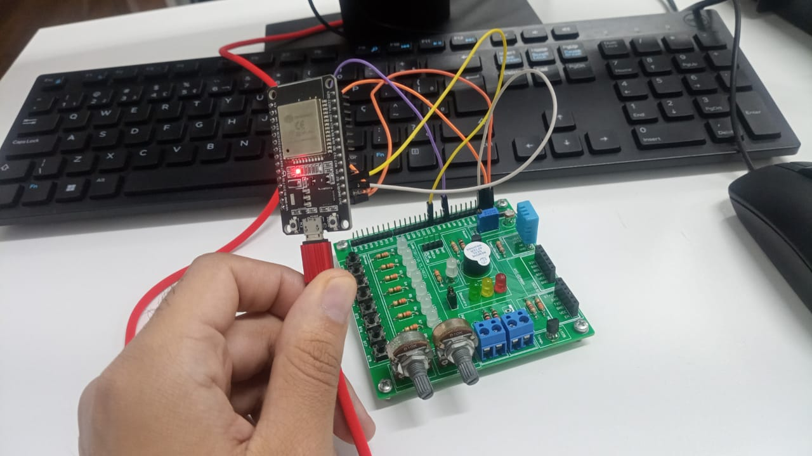

# Monitoramento IoT com ESP32

Este projeto utiliza o ESP32 para monitorar luminosidade, temperatura e umidade, enviando os dados via MQTT para um broker. O sistema também permite o controle remoto de um LED onboard através de comandos MQTT.

## Descrição do Projeto

O sistema de monitoramento IoT utiliza sensores para medir luminosidade, temperatura e umidade, e envia essas informações para um servidor remoto utilizando o protocolo MQTT. O ESP32, que controla os sensores, se conecta a uma rede Wi-Fi e é capaz de receber comandos para ligar ou desligar um LED onboard.

### Componentes Utilizados:
- ESP32
- Sensor DHT11 (Temperatura e Umidade)
- Sensor de Luminosidade (LDR)
- Broker MQTT



## Código

```cpp
#include <WiFi.h>
#include <PubSubClient.h>
#include <Adafruit_Sensor.h>
#include <DHT.h>
#include <DHT_U.h>

// Configurações - variáveis editáveis
const char* default_SSID = "FIAP-IBM"; // Nome da rede Wi-Fi, importante a sua rede wi-fi ter suporte a dispositivos de 2,4GHz devido ao ESP32 utilizar essa frequência
const char* default_PASSWORD = "Challenge@24!"; // Senha da rede Wi-Fi
const char* default_BROKER_MQTT = "34.203.196.154"; // IP do Broker MQTT
const int default_BROKER_PORT = 1883; // Porta do Broker MQTT
const char* default_TOPICO_SUBSCRIBE = "/TEF/device008/cmd"; // Tópico MQTT de escuta
const char* default_TOPICO_PUBLISH_1 = "/TEF/device008/attrs"; // Tópico MQTT de envio de informações para Broker
const char* default_TOPICO_PUBLISH_2 = "/TEF/device008/attrs/p"; // Tópico MQTT de envio de informações para Broker
const char* default_TOPICO_PUBLISH_3 = "/TEF/device008/attrs/t"; // Tópico MQTT de envio de informações para Broker
const char* default_TOPICO_PUBLISH_4 = "/TEF/device008/attrs/u"; // Tópico MQTT de envio de informações para Broker
const char* default_ID_MQTT = "fiware_008"; // ID MQTT
const int default_D4 = 2; // Pino do LED onboard
// Declaração da variável para o prefixo do tópico
const char* topicPrefix = "device008";
 
// Variáveis para configurações editáveis
char* SSID = const_cast<char*>(default_SSID);
char* PASSWORD = const_cast<char*>(default_PASSWORD);
char* BROKER_MQTT = const_cast<char*>(default_BROKER_MQTT);
int BROKER_PORT = default_BROKER_PORT;
char* TOPICO_SUBSCRIBE = const_cast<char*>(default_TOPICO_SUBSCRIBE);
char* TOPICO_PUBLISH_1 = const_cast<char*>(default_TOPICO_PUBLISH_1);
char* TOPICO_PUBLISH_2 = const_cast<char*>(default_TOPICO_PUBLISH_2);
char* TOPICO_PUBLISH_3 = const_cast<char*>(default_TOPICO_PUBLISH_3);
char* TOPICO_PUBLISH_4 = const_cast<char*>(default_TOPICO_PUBLISH_4);
char* ID_MQTT = const_cast<char*>(default_ID_MQTT);
int D4 = default_D4;
 
WiFiClient espClient;
PubSubClient MQTT(espClient);
char EstadoSaida = '0';
 
// selecione um sensor, retirando o comentário - duas barras
#define DHTTYPE    DHT11                           // Sensor DHT11
//#define DHTTYPE      DHT22                       // Sensor DHT22 ou AM2302
#define DHTPIN 4                                   // Pino do Arduino conectado no Sensor(Data)
DHT_Unified dht(DHTPIN, DHTTYPE);                  // configurando o Sensor DHT - pino e tipo
 
void initSerial() {
    Serial.begin(115200);
}
 
void initWiFi() {
    delay(10);
    Serial.println("------Conexao WI-FI------");
    Serial.print("Conectando-se na rede: ");
    Serial.println(SSID);
    Serial.println("Aguarde");
    reconectWiFi();
}
 
void initMQTT() {
    MQTT.setServer(BROKER_MQTT, BROKER_PORT);
    MQTT.setCallback(mqtt_callback);
}
 
void setup() {
    InitOutput();
    initSerial();
    initWiFi();
    initMQTT();
    delay(5000);
    MQTT.publish(TOPICO_PUBLISH_1, "s|on");
}
 
void loop() {
    VerificaConexoesWiFIEMQTT();
    EnviaEstadoOutputMQTT();
    handleLuminosity();
    handleHumidity();
    handleTemperature();
    MQTT.loop();
}
 
void reconectWiFi() {
    if (WiFi.status() == WL_CONNECTED)
        return;
    WiFi.begin(SSID, PASSWORD);
    while (WiFi.status() != WL_CONNECTED) {
        delay(100);
        Serial.print(".");
    }
    Serial.println();
    Serial.println("Conectado com sucesso na rede ");
    Serial.print(SSID);
    Serial.println("IP obtido: ");
    Serial.println(WiFi.localIP());
 
    // Garantir que o LED inicie desligado
    digitalWrite(D4, LOW);
}
 
void mqtt_callback(char* topic, byte* payload, unsigned int length) {
    String msg;
    for (int i = 0; i < length; i++) {
        char c = (char)payload[i];
        msg += c;
    }
    Serial.print("- Mensagem recebida: ");
    Serial.println(msg);
 
    // Forma o padrão de tópico para comparação
    String onTopic = String(topicPrefix) + "@on|";
    String offTopic = String(topicPrefix) + "@off|";
 
    // Compara com o tópico recebido
    if (msg.equals(onTopic)) {
        digitalWrite(D4, HIGH);
        EstadoSaida = '1';
    }
 
    if (msg.equals(offTopic)) {
        digitalWrite(D4, LOW);
        EstadoSaida = '0';
    }
}
 
void VerificaConexoesWiFIEMQTT() {
    if (!MQTT.connected())
        reconnectMQTT();
    reconectWiFi();
}
 
void EnviaEstadoOutputMQTT() {
    if (EstadoSaida == '1') {
        MQTT.publish(TOPICO_PUBLISH_1, "s|on");
        Serial.println("- Led Ligado");
    }
 
    if (EstadoSaida == '0') {
        MQTT.publish(TOPICO_PUBLISH_1, "s|off");
        Serial.println("- Led Desligado");
    }
    Serial.println("- Estado do LED onboard enviado ao broker!");
    delay(1000);
}
 
void InitOutput() {
    pinMode(D4, OUTPUT);
    digitalWrite(D4, HIGH);
    boolean toggle = false;
 
    for (int i = 0; i <= 10; i++) {
        toggle = !toggle;
        digitalWrite(D4, toggle);
        delay(200);
    }
}
 
void reconnectMQTT() {
    while (!MQTT.connected()) {
        Serial.print("* Tentando se conectar ao Broker MQTT: ");
        Serial.println(BROKER_MQTT);
        if (MQTT.connect(ID_MQTT)) {
            Serial.println("Conectado com sucesso ao broker MQTT!");
            MQTT.subscribe(TOPICO_SUBSCRIBE);
        } else {
            Serial.println("Falha ao reconectar no broker.");
            Serial.println("Haverá nova tentativa de conexão em 2s");
            delay(2000);
        }
    }
}
 
void handleLuminosity() {
    const int potPin = 34;
    int sensorValue = analogRead(potPin);
    int luminosity = map(sensorValue, 0, 4095, 0, 100);
    String mensagem = String(luminosity);
    Serial.print("Valor da luminosidade: ");
    Serial.println(mensagem.c_str());
    MQTT.publish(TOPICO_PUBLISH_2, mensagem.c_str());
}
 
void handleHumidity() {
    sensors_event_t event;
    dht.humidity().getEvent(&event);
    String mensagem = String(event.relative_humidity);  
 
    Serial.print("Valor da umidade: ");
    Serial.println(mensagem.c_str());
    MQTT.publish(TOPICO_PUBLISH_3, mensagem.c_str());
}
 
void handleTemperature() {
    sensors_event_t event;
    dht.temperature().getEvent(&event);
    String mensagem = String(event.temperature);
    Serial.print("Valor da temperatura: ");
    Serial.println(mensagem.c_str());
    MQTT.publish(TOPICO_PUBLISH_4, mensagem.c_str());
}


## Como Executar

1. Instale as bibliotecas necessárias:
   - WiFi.h
   - PubSubClient.h
   - DHT.h
   - Adafruit_Sensor.h
2. Conecte o ESP32 à rede Wi-Fi usando as credenciais definidas no código.
3. Configure o broker MQTT no código e verifique se ele está ativo.
4. Faça o upload do código para o ESP32.


